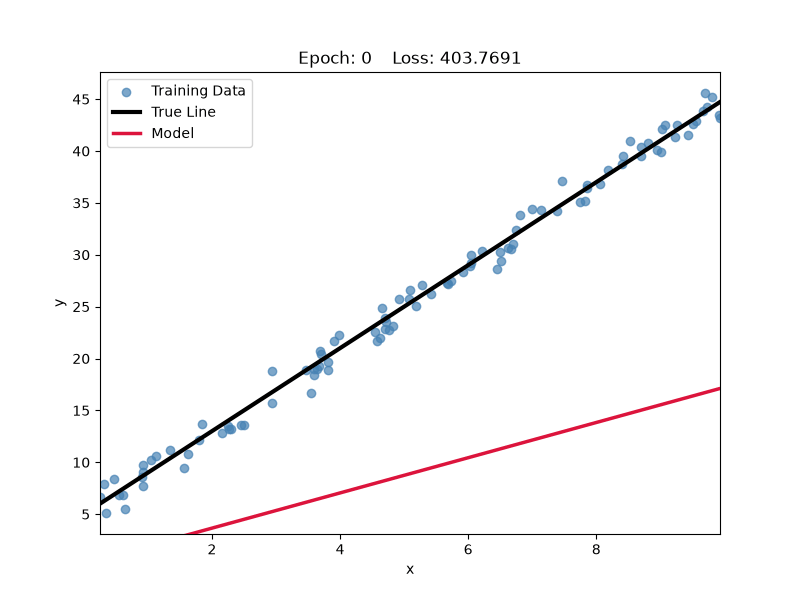

# Linear Regression from Scratch (NumPy)

A pure **NumPy** implementation of Linear Regression trained with **Batch Gradient Descent**. This project was built to understand the mathematics behind linear regression rather than relying on machine learning libraries such as scikit-learn.

---

## Features

* ✅ Linear Regression implemented from scratch
* ✅ Vectorized implementation using NumPy
* ✅ Batch Gradient Descent optimization
* ✅ Mean Squared Error (MSE) loss
* ✅ Support for multiple input features
* ✅ Training loss tracking
* ✅ Animated visualization of gradient descent
* ✅ Clean, modular project structure

---

## Gradient Descent Visualization

The animation below shows how Gradient Descent gradually updates the regression line until it converges to the true relationship between the data and the target.



---

## the algorithm

Input Features (X)
        │
        ▼
Prediction = X · W + b
        │
        ▼
Compute Error (ŷ - y)
        │
        ▼
Compute MSE Loss
        │
        ▼
Compute Gradients
        │
        ▼
Update W and b
        │
        ▼
Repeat until convergence

## Mathematical Background

The model predicts the target using the equation:

```text
ŷ = X · W + b
```

where:

* **X** : Feature matrix of shape `(n_samples, n_features)`
* **W** : Weight vector of shape `(n_features, 1)`
* **b** : Bias (scalar)
* **ŷ** : Predicted values

The loss function is the **Mean Squared Error (MSE)**:

```text
J(W, b) = (1 / (2m)) * Σ (ŷᵢ - yᵢ)²
```

where:

* `m` is the number of training samples.
* `ŷᵢ` is the prediction for sample `i`.
* `yᵢ` is the true target value.

The gradients are:

```text
dJ/dW = (1 / m) * Xᵀ(ŷ - y)

dJ/db = (1 / m) * Σ(ŷ - y)
```

Gradient Descent updates the parameters using:

```text
W = W - α * dJ/dW

b = b - α * dJ/db
```

where **α** is the learning rate.


---

## Example

```python
from src.linear_regression import LinearRegression

model = LinearRegression(
    epochs=1000,
    learning_rate=0.01
)

model.fit(X, y)

predictions = model.predict(X)
```

---


## Example Dataset

Synthetic data is generated using

```python
X = rng.uniform(0, 10, size=(100, 1))

true_w = 4.0
true_b = 5.0

noise = rng.normal(0, 1, size=(100, 1))

y = X * true_w + true_b + noise
```

---

## Technologies

* Python
* NumPy
* Matplotlib

---

## Learning Goals

This project was created to develop a deep understanding of:

* Vectorized linear algebra
* Matrix calculus
* Gradient Descent
* Mean Squared Error
* Data normalization
* Writing clean, modular machine learning code
* Building machine learning algorithms from scratch

---

## Future Improvements

* [ ] Mini-Batch Gradient Descent
* [ ] Stochastic Gradient Descent (SGD)
* [ ] L2 Regularization (Ridge Regression)
* [ ] L1 Regularization (Lasso)
* [ ] Early Stopping
* [ ] Feature Scaling utilities
* [ ] Model serialization
* [ ] Unit tests
* [ ] Performance benchmarks
* [ ] Logistic Regression from scratch

---

## License

This project is open source and available under the MIT License.
